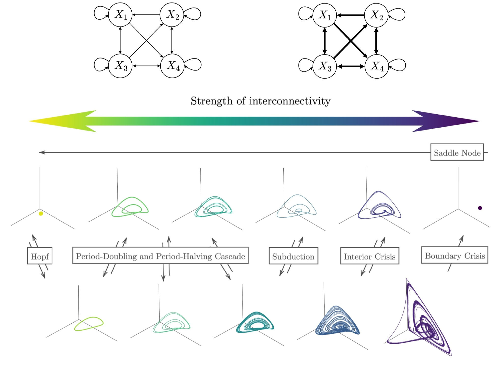
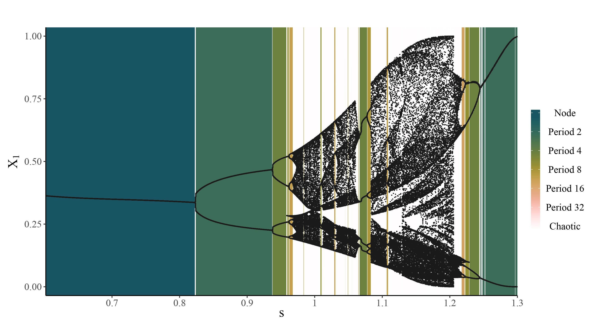

<!-- README.md is generated from README.Rmd. Please edit that file -->

```{r, include = FALSE}
knitr::opts_chunk$set(
  collapse = TRUE,
  comment = "#>",
  fig.path = "man/figures/README-",
  out.width = "100%"
)
```

# bifurcationEWS

*bifurcationEWS* is an R package accompanying the paper "Early Warning Signals of Complex Critical Transitions in Deterministic Dynamics" by Evers et al. (submitted). The package supports timeseries simulation of many deterministic bifurcations, computation of some univariate and multivariate Early Warning Signals (EWS), and an assessment of the performance of EWS. As an example, it uses the four-dimensional Generalised Lotka Volterra (GLV) model, with strength of interconnectivity $s$ as the control parameter.

```{r, echo=FALSE, fig.align='center'}

```

These transitions can also be visualised using a bifurcation diagram:

```{r, echo=FALSE, fig.align='center'}

```

## Installation

You can install the development version of bifurcationEWS from [GitHub](https://github.com/) with:

```{r include=FALSE}
# install.packages("devtools")
# devtools::install_github("KCEvers/bifurcationEWS")
library(bifurcationEWS)
```

See the vignette for a demonstration on how to use the package.

## Questions

For any questions, please contact Kyra Evers at kyra.c.evers@gmail.com.


<!-- You'll still need to render `README.Rmd` regularly, to keep `README.md` up-to-date. `devtools::build_readme()` is handy for this. -->
