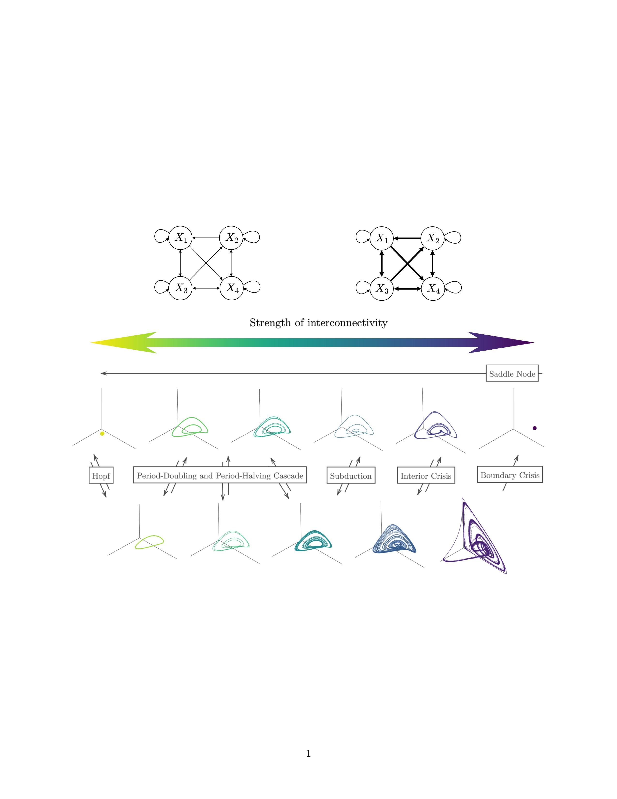

<!-- README.md is generated from README.Rmd. Please edit that file -->

# bifurcationEWS

bifurcationEWS is an R package for running an Early Warning Signal
analysis to anticipate deterministic bifurcations in dynamical systems.
The package supports timeseries simulation of many deterministic
bifurcations, computation of some univariate and multivariate EWS, and
an assessment of the performance of EWS.

<!-- badges: start -->
<!-- badges: end -->

## Installation

You can install the development version of bifurcationEWS from
[GitHub](https://github.com/) with:



## Generate timeseries

Let’s generate some timeseries to see what the Generalized Lotka
Volterra (GLV) model can do:

``` r
# # Set up parameters
# pars <- setup_pars(model_name = "detGLV")
# # Define control parameter
# pars$bifpar_pars = list(
#         bifpar_start = .96,
#         bifpar_end = .97,
#         pre_steps = 0,
#         baseline_steps = 0,
#         transition_steps = 21,
#         post_steps = 0
#       )
# # Generate Hopf bifurcation timeseries
# GLV = bifurcation_ts(model = pars$model,
#                           model_pars = pars$model_pars,
#                          X_names = pars$X_names,
#                          bifpar_pars = pars$bifpar_pars,
#                          timestep = .1,
#                          nr_timesteps = 500, silent = F
#                         )
# df = GLV$df
```

``` r

# regimes = find_regimes(GLV, factor_k = 1)
# plot_bifdiag(regimes, sel_variables = "X1")
```

<!-- You'll still need to render `README.Rmd` regularly, to keep `README.md` up-to-date. `devtools::build_readme()` is handy for this. -->
<!-- You can also embed plots, for example: -->
<!-- ```{r pressure, echo = FALSE} -->
<!-- plot(pressure) -->
<!-- ``` -->
<!-- In that case, don't forget to commit and push the resulting figure files, so they display on GitHub and CRAN. -->
