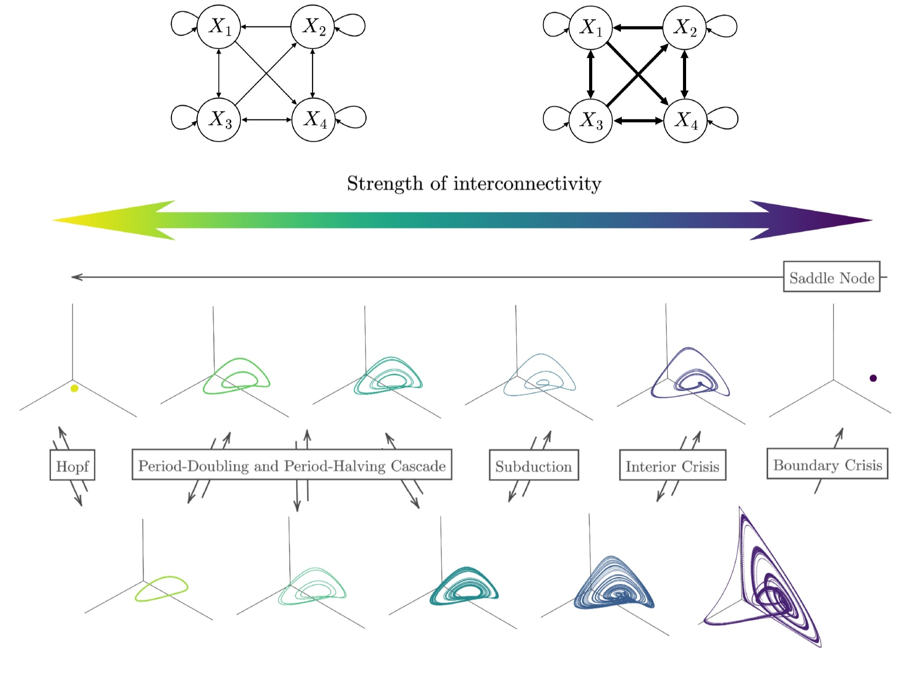

<!-- README.md is generated from README.Rmd. Please edit that file -->

# bifurcationEWS

*bifurcationEWS* is an R package accompanying the paper “Early Warning
Signals of Complex Critical Transitions in Deterministic Dynamics” by
Evers et al. (submitted to *Nonlinear Dynamics*). The package supports
timeseries simulation of many deterministic bifurcations, computation of
some univariate and multivariate Early Warning Signals (EWS), and an
assessment of the performance of EWS. As an example, it uses the
four-dimensional Generalised Lotka-Volterra (GLV) model, with strength
of interconnectivity $s$ as the control parameter.



These transitions can also be visualised using a bifurcation diagram:


## Installation

You can install *bifurcationEWS* with:

``` r
# install.packages("devtools")
devtools::install_github("KCEvers/bifurcationEWS")
library(bifurcationEWS)
```

See the vignette for a demonstration on how to use the package. Note
that the code will need heavy editing if used for any other purpose that
reproducing the results of the paper.

## Questions

For any questions or feedback, please contact Kyra Evers at
<kyra.c.evers@gmail.com>.

<!-- You'll still need to render `README.Rmd` regularly, to keep `README.md` up-to-date. `devtools::build_readme()` is handy for this. -->
