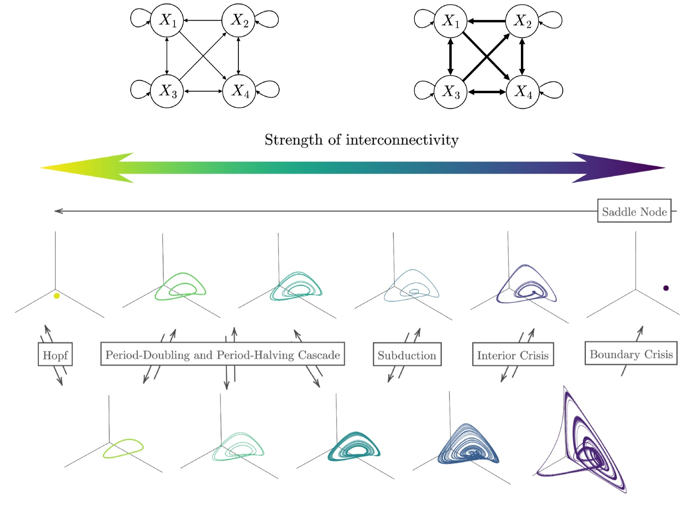

```{r setup, include=FALSE}
knitr::opts_chunk$set(echo = TRUE, fig.align = 'center', fig.width=7, fig.height=5)
rgl::setupKnitr(autoprint = TRUE) # suppress opening new window
``` 

```{r packages, message = FALSE,	warning = FALSE, include = FALSE}
# devtools::install_github("KCEvers/bifurcationEWS")
library(bifurcationEWS)
library(ggh4x)
library(dplyr)
library(plotly)
library(ggplot2)
library(foreach)
```

## The Generalized Lotka-Volterra (GLV) Model

```{r overview figure, echo=FALSE, out.width = "800px", out.height = "600px"}

```

The GLV describes a system of $N$ species competing for limited resources, and how they interact and evolve over time. The model includes a growth or death rate ${r}_{i}$ as well as community matrix encoding interspecies dynamics $\mathbf{C}$,

\begin{align*}
\frac{d {x}_{i}}{d t} = {r}_{i} {x}_{i} (1 - \sum_{j=1}^{N} {C}_{ij} {x}_{j})    
\end{align*}

$C_{ij}$ denotes the effect of an increase in species $j$ on species $i$, or equivalently, the receiving effect of species $i$ from species $j$. Extending the simple two-species predator-prey model with only competitive interactions, the GLV can display three types of interactions: competitive (${C}_{ij} > 0$ and ${C}_{ji} > 0$) (note the minus sign in the Equation), mutualistic (${C}_{ij} < 0$ and ${C}_{ji} < 0$), or predator-prey (${C}_{ij} > 0$ and ${C}_{ji} < 0$, or ${C}_{ij} < 0$ and ${C}_{ji} > 0$).

Manipulating the connectivity matrix $\mathbf{C}$ in a specific way results in a well-studied sequence of regimes: the onset of oscillations with increasing amplitude in a Hopf bifurcation, with increasingly intricate oscillations created by a period-doubling cascade to chaos, which is interrupted by intermittent periodic windows, ending in a boundary crisis in which the chaotic attractor is extinguished, after which the system settles into a fixed point. Though a specific set of parameters is required to achieve this sequence of behaviours, these critical transitions are quite generic and occur widely across alternative realisations of the GLV and many other dynamical systems, making them of general interest to non-linear and chaotic systems. 

Specifically, this sequence of dynamical regimes may be generated by fixing
\begin{align*}
\mathbf{r} = \begin{bmatrix} 1\\
0.72\\
1.53\\
1.27
\end{bmatrix} \quad 
\mathbf{C} = \begin{bmatrix} 1 & 1.09 & 1.52 & 0\\
0 & 1 & 0.44 & 1.36 \\
2.33 & 0 & 1 & 0.47\\
1.21 & 0.51 & 0.35 & 1
\end{bmatrix}
\end{align*}
and multiplying the off-diagonal elements of $\mathbf{C}$ with a single control parameter $s$. If $s = 0$, the system is completely decoupled. Increasing the control parameter $s$ results in increasing interspecies competition (as the species are purely competitive) while holding the growth rate ${r}_{i}$ constant (see Figure 1, top panel). As transitions are induced by manipulating only one control parameter, all resulting bifurcations are of co-dimension one. Importantly, $\mathbf{C}$ is asymmetrical, which allows the system to occupy a large range of complex attractors.

## Generating timeseries

To generate timeseries for the Generalised Lotka-Volterra (GLV) model, we need to specify the value of the control parameter $s$. Below, we see the timeseries of the first variable $X_1$ of the GLV at $s = .98$ - that looks like chaos!

```{r demo bifurcation_ts, echo=TRUE}
pars <- setup_pars(model_name = "detGLV")
nr_timesteps = 1000
s = .98
bifpar_list <- list(list("s" = s))
GLV = bifurcation_ts(model = pars$model, model_pars = pars$model_pars,
                 bifpar_list = bifpar_list,
                 nr_timesteps = nr_timesteps,
                 X_names = pars$X_names,
                 seed_nr = round(s*100), silent = T
                 )

# Timeseries plot
pl_ts = GLV$df %>% 
  filter(time > nr_timesteps*.25) %>%
  ggplot() + 
  geom_line(aes(x = time, y = X1), linewidth = .1) +
  geom_point(aes(x = time, y = X1), size = .1) +
    labs(x = 'Time', y = expression(X[1]), title = sprintf("Timeseries for s = %.2f", s)) 

print(style_plot(pl_ts))
```

We can repeat this procedure for different values of $s$ to get an idea of the dynamics that the GLV is capable of. Remember that increasing $s$ intensifies interspecies competition, which results in a larger range of values, as shown below.

```{r demo bifurcation_ts multiple s, echo=TRUE}
GLVs = list()
ss =  c(.85, .94, .969, .99, 1.08, 1.12)
for (s_idx in seq_along(ss)){
  s = ss[s_idx]
  bifpar_list <- list(list("s" = s))
  GLV = bifurcation_ts(model = pars$model, model_pars = pars$model_pars,
                 bifpar_list = bifpar_list,
                 nr_timesteps = nr_timesteps,
                 X_names = pars$X_names,
                 seed_nr = round(s*100), silent = T
                 )
  GLVs[[s_idx]] = GLV$df %>% dplyr::mutate(s = sprintf("s = %.4f", s), bifpar_idx = s_idx)
}

GLV_dfs = GLVs %>% do.call(rbind, .) %>% as.data.frame()

# Timeseries plot
pl_ts = GLV_dfs %>% 
  filter(time > nr_timesteps*.25) %>%
  ggplot() + 
  geom_line(aes(x = time_idx, y = X1, color = factor(s)), linewidth = .1) +
  geom_point(aes(x = time_idx, y = X1, color = factor(s)), size = .1) +
    labs(x = 'Time', y = expression(X[1]), title = "Timeseries for different control parameter values") + 
  facet_wrap(s ~ ., ncol = 2) +
  viridis::scale_color_viridis(discrete=TRUE, name = "Bifurcation parameter", end = .9) +
  coord_cartesian(expand = F)
  
print(style_plot(pl_ts) + theme(legend.position = 'none'))
```

These dynamics can be better visualised in 3D phase space, where the underlying attractors become apparent. Click to zoom in and move them around!

```{r 3D phase space, echo=FALSE}
landscape_GLVs = plot_3D_landscape_trans(GLV_dfs %>% filter(time > nr_timesteps*.25), # Remove burn-in phase for plotting
                                         bifpar_idxs = seq_along(ss),
                                         bifpar_values = ss, size_line = .05, size_marker = .5
                                         )
landscape_GLVs
```


## Generating bifurcations

By changing $s$ gradually, we may produce *bifurcations*: qualitative changes in system dynamics due to small changes in the control parameter. Below we generate a *Hopf bifurcation*: a switch from a node to periodic attractor. Generating these long timeseries takes quite some time...

```{r Hopf, echo=TRUE}
# Specify bifurcation parameter change
bifpar_pars = list(
  bifpar_start = .78,
  bifpar_end = .85,
  pre_steps = 0,
  baseline_steps = 0,
  transition_steps = 101,
  post_steps = 0
)

# Simulate timeseries
if (F){
  GLV_Hopf = bifurcation_ts(model = pars$model, model_pars = pars$model_pars,
                   bifpar_pars = bifpar_pars,
                   nr_timesteps = nr_timesteps,
                   X_names = pars$X_names,
                    fs = pars$fs,
                   seed_nr = round(s*100), silent = T
                   )
  saveRDS(GLV_Hopf, "GLV_Hopf.RDS")
}
GLV_Hopf = readRDS("GLV_Hopf.RDS")

# Plot 3D landscape
sel_bifpar_idxs = round(c(.35, .66, .68, .78) * length(GLV_Hopf$bifpar_list)) # Select indices of bifurcation parameter sequence to plot
landscape_GLVs = plot_3D_landscape_trans(GLV_Hopf$df %>% 
                                           filter(time > nr_timesteps*.25), # Remove burn-in phase for plotting
                                         bifpar_idxs = sel_bifpar_idxs,
                                         bifpar_values = purrr::map(GLV_Hopf$bifpar_list[sel_bifpar_idxs], "s"), 
                                         size_line = .05,
                                         size_marker = c(2,2, rep(.5, 2)), # Make marker more visible for fixed points
                                         x_range = c(0,.5), y_range = c(0.25,0.6),
                                         z_range = c(0,0.5)
                                         )
landscape_GLVs
```

An example of a more complex bifurcation is a *subduction*: a sudden switch from periodic to chaotic behaviour.

```{r subduction, echo=TRUE}
# Specify bifurcation parameter change
bifpar_pars = list(
  bifpar_start = 1.01,
  bifpar_end = 1.02,
  pre_steps = 0,
  baseline_steps = 0,
  transition_steps = 51,
  post_steps = 0
)

# Simulate timeseries
if (F){
  GLV_subduction = bifurcation_ts(model = pars$model, model_pars = pars$model_pars,
                   bifpar_pars = bifpar_pars,
                   nr_timesteps = nr_timesteps,
                   X_names = pars$X_names,
                     fs = pars$fs,
                   seed_nr = round(s*100), silent = T
                   )
  saveRDS(GLV_subduction, "GLV_subduction.RDS")
}
GLV_subduction = readRDS("GLV_subduction.RDS")

# Plot 3D landscape
sel_bifpar_idxs = round(c(.1, .2, .25, .27, .3, 1) * length(GLV_subduction$bifpar_list)) # Select indices of bifurcation parameter sequence to plot
landscape_GLVs = plot_3D_landscape_trans(GLV_subduction$df %>% 
                                           filter(time > nr_timesteps*.25), # Remove burn-in phase for plotting
                                         bifpar_idxs = sel_bifpar_idxs,
                                         bifpar_values = purrr::map(GLV_subduction$bifpar_list[sel_bifpar_idxs], "s"), 
                                         size_line = .05, size_marker = .5,
                                         # x_range = c(0.1,.9), y_range = c(0.1,.9),
                                         # z_range = c(0.1,.9)
                                         )
landscape_GLVs
```


### Bifurcation diagram
To visualise these changes, we can also use *bifurcation diagram*, which shows the peaks of the timeseries for each value of the control parameter. Let's look at the bifurcation diagram of the Hopf bifurcation.

```{r bifurcation diagram with only peaks, echo=TRUE}
peaks_df = peaks_bifdiag(GLV_Hopf$df,
                             GLV_Hopf$X_names) %>%
      filter(.data$bifpar_idx >= 5) # Skip initial settling in points

point_size = 40 / length(unique(peaks_df$bifpar_idx))
pl_peaks = peaks_df %>% dplyr::filter(variable=="X1") %>%
  mutate(minmax = ifelse(minmax == "minpeak", "Trough", ifelse(minmax == "maxpeak", "Peak", minmax))) %>%
      ggplot() + geom_point(aes(x = bifpar_idx, y = X, col = minmax), size = point_size) +
  viridis::scale_color_viridis(discrete = T, name = "") +
      labs(x = 'Bifurcation parameter', y = "X1", title = "Transient bifurcation diagram") +
  theme(legend.position = 'bottom')
print(style_plot(pl_peaks))
```


```{r bifurcation diagram with regimes, echo=TRUE, fig.width=9}
# Find regimes
regime_list = find_regimes(GLV_Hopf)
print(as.data.frame(regime_list$regime_bounds))

# Regimes and regime boundaries
pl_regimes = peaks_df %>% ggplot() +
  geom_rect(data=regime_list$regimes,aes(xmin=start_bifpar_idx,xmax=end_bifpar_idx,
                                         ymin=-Inf, ymax=Inf, fill = regime), linewidth = .5, alpha = .4)

# If a regime was found
if (any(!is.na(regime_list$regime_bounds$regime1))){
    pl_regimes = pl_regimes +
  geom_vline(data = regime_list$regime_bounds, aes(
    xintercept = regime1_end_idx,
    col = regime_switch_type), linewidth = 1.3, linetype = 'dashed') +
  geom_vline(data = regime_list$regime_bounds, aes(
    xintercept = regime2_start_idx,
    col = regime_switch_type), linewidth = 1.3, linetype = 'dashed') +
  viridis::scale_color_viridis(
    discrete=TRUE,
    option = 'magma',
    begin = 0, end = .8, name = "Regime switch (end of first and start of second regime)") +
  viridis::scale_fill_viridis(
    discrete=TRUE,
    option = 'turbo',
    begin = 0, end = 1, name = "Period",
    guide = guide_legend(override.aes = list(alpha = 1,
                                             size = 3)))
    }

# Add points
pl_regimes = pl_regimes +
    geom_point(aes(x = bifpar_idx, y = X),col='grey30',alpha = .8, size = point_size*2) +
    guides(color = guide_legend(ncol = 1), fill = guide_legend(ncol = 1)) + # x rows in legend
  ggh4x::facet_grid2(variable ~ .) +
  labs(x = 'Bifurcation parameter', y = "", title = "Transient bifurcation diagram")

print(style_plot(pl_regimes))

```


## Early Warning Signals (EWS)

What EWS might signal an upcoming Hopf bifurcation? Below, we add some observational noise to the Hopf timeseries, and apply the EWS metrics to the timeseries corresponding to each step in the bifurcation parameter.

```{r add observational noise, echo=TRUE}
# Add observational noise to timeseries
noisy_df = add_obs_noise(
  GLV_Hopf$df %>% filter(bifpar_idx >= 5),
  GLV_Hopf$X_names,
  noise_mean = 0,
  noise_sigma =  c(0.0001, .02, .04)[2],
  noise_constant = 0,
  seed_nr = 10)

# Plot noisy timeseries
pl_ts = noisy_df %>% 
  filter(bifpar_idx == 70) %>%
  ggplot() + 
  geom_line(aes(x = time, y = X1), linewidth = .1) +
  geom_point(aes(x = time, y = X1), size = .1) +
    labs(x = 'Time', y = expression(X[1]), title = sprintf("Noisy timeseries for Hopf bifurcation")) +
  scale_x_continuous(expand = c(.01, .01))

print(style_plot(pl_ts))
```

```{r EWS, echo=TRUE, fig.height=20}
# Define EWS functions
uni_metrics = c(
  "mean" = mean,
  "variance" = var,
  "COV" = get_COV,
  "autocorrelation" = get_autocorr,
  "skewness" = moments::skewness,
  "kurtosis" = moments::kurtosis,
  "spectral_exp" = get_spectral_exp,
  "spectral_ratio" = get_spectral_ratio
)
multi_metrics = c(
  "meanAbsCrossCorr" = get_conn,
  "largestLambdaCovMatrix" = eigenvalue,
  "spatial_variance" = spatial_variance,
  "spatial_skewness" = spatial_skewness,
  "spatial_kurtosis" = spatial_kurtosis,
  "Smax" = get_Smax
)

# Arguments for EWS metrics
EWS_args = list(
  "spectral_exp" = list(
    fs = GLV_Hopf$fs,
    nr_timesteps = GLV_Hopf$nr_timesteps
  ),
  "spectral_ratio" = list(
    fs = GLV_Hopf$fs,
    nr_timesteps = GLV_Hopf$nr_timesteps,
    f_min_to_f_max = c(GLV_Hopf$fs/2/10, GLV_Hopf$fs/2)
  ),
  "Smax" = list(
    fs = GLV_Hopf$fs,
    nr_timesteps = GLV_Hopf$nr_timesteps
  )
)


# Compute EWS
start_t = Sys.time()
df_EWS = run_bifEWS(noisy_df,
                          GLV_Hopf$X_names,
                          uni_metrics,
                          multi_metrics,
                          EWS_args = EWS_args,
                          save_intermediate = F
                          )
print(sprintf("Computing EWS took %s", Sys.time() - start_t))

# Plot EWS
pl_EWS <- df_EWS %>%
          # merge(regime_bounds, all = TRUE) %>%
          ggplot() +
          geom_line(aes(x = bifpar_idx, y = value), linewidth = .45, alpha = .5, color ='grey50') +
          geom_point(aes(x = bifpar_idx, y = value), size = .6, color ='grey20') +
          ggh4x::facet_wrap2(. ~ metric, ncol = 2, scales = "free_y") +
          labs(x = 'Bifurcation parameter s',
               y = "",
               title = "Early Warning Signals")
print(style_plot(pl_EWS))

```

To get a sense of the sensitivity and specificity of each metric, the procedure needs to be repeated for many realisations of each bifurcation, for which we need high computing power. See the HPC folder for scripts suited for a high performance cluster. 
